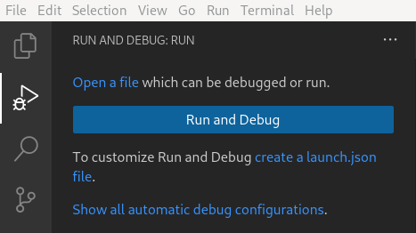
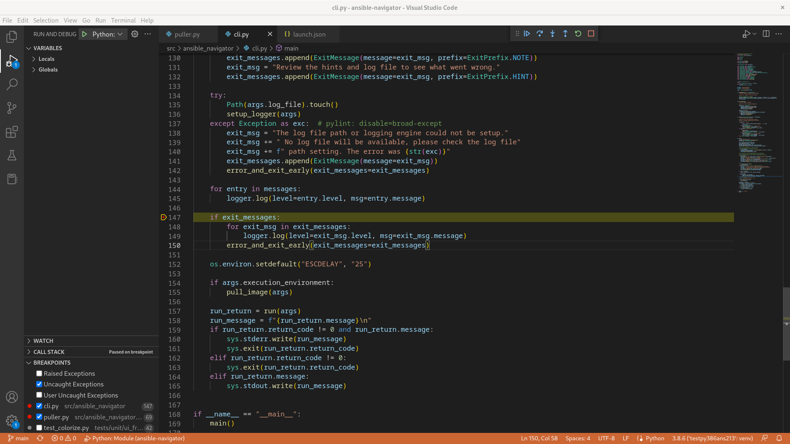

# Debugging Ansible Navigator with VS Code

Interactive way to debug ansible-navigator with VS Code.

## Getting started with Ansible-Navigator

After cloning the repository, all we need is to install ansible-navigator from the source. Use the following command in workspace (root folder of navigator). This will install all the required dependencies for testing the local changes.

```
pip install -e .
```

### Configure VS code:

Once we are inside vscode, we need to generate the configuration file 'launch.json'. There are two ways to do so.

**Method 1:**  Use Run and Debug View

Select the `Run and Debug` icon in the Activity Bar of VS Code to create `launch.json` file. Choose 'Python' as debugger and 'Module' as debug configuration. This step will create launch.json with default configuration which can be changed later on. If running and debugging is not yet configured (no launch.json has been created), VS Code shows the view like this.



**Method 2:**  Use Command Line

VS Code keeps debugging configuration information in a launch.json file located in a `.vscode ` folder in your workspace (project root folder). Hence follow the given steps to generate 'launch.json' using command line.

```
machine@machine ~/a/c/ansible-navigator
 ❯ mkdir .vscode
machine@machine ~/a/c/ansible-navigator
 ❯ cd .vscode
machine@machine ~/a/c/ansible-navigator/.vscode
 ❯ touch launch.json
```

Drop the below configuration in your launch.json

```
{
  "version": "0.2.0",
  "configurations": [
    {
      "name": "Python: Module",
      "type": "python",
      "request": "launch",
      "module": "ansible_navigator",
      "cwd": "${workspaceFolder}",
      "justMyCode": false
    }
  ]
}
```

Now, the final steps!

* Put breakpoint(s) in the code where needed.
* Hover to the Menu Bar and click **Run -> Start Debugging** to start the debugger.




At this point, the debugger should hit your breakpoint and start the debugging session.


### Additional Configuration:

Ansible-Navigator comes in with bunch of [commands]. To debug around any specific subcommand, we will just need to add `args` attribute (arguments passed to the program to debug) in our launch.json configuration file.

[commands]:https://ansible-navigator.readthedocs.io/en/latest/subcommands/

**Example:**                                                                    
* To debug subcommand `ansible-navigator images`, add one more attribute as `"args": ["images"]` in our previously configured launch.json.
* To debug subcommand `ansible-navigator collections`, add one more attribute as `"args": ["collections"]` in launch.json, and so on.                 
* Moreover, to debug subcommands with some parameter use `"args": ["subcommand-name", "--", "parameter"]`
* For example adding an attribute as `"args": ["exec", "--", "pwd"]` in launch.json will ensure to debug the command `ansible-navigator exec -- pwd`                                 
* While debugging any subcommand with arguments, make sure to use one *args* entry at a time in our configuration (comment/remove the ones not in use).

Here is an example of debugging `ansible-navigator exec -- pwd` using *args* attribute-

```
{
  "version": "0.2.0",
  "configurations": [
    {
      "name": "Python: Module",
      "type": "python",
      "request": "launch",
      "module": "ansible_navigator",
      "args": ["exec", "--", "pwd"],
      // "args": ["images"],
      // "args": ["collections"],
      "cwd": "${workspaceFolder}",
      "justMyCode": false
    }
  ]
}
```

### Useful Links: 

* VS code debugging [guide].
* Refer official [documentation] of navigator for more details.
* Facilitate [Python Debugger] (pdb) in navigator for pure command line debugging.

[guide]: https://code.visualstudio.com/docs/editor/debugging
[documentation]: https://ansible-navigator.readthedocs.io/
[Python Debugger]: https://www.geeksforgeeks.org/python-debugger-python-pdb/

## Happy Debugging :)